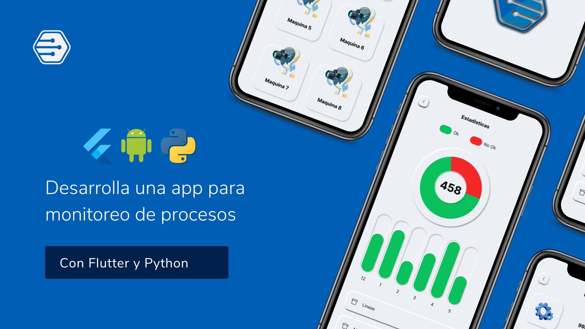

# Visiony

Curso para aplicación de procesos de visión

## ¿Qué es esto?

Este es el código completo de la aplicación que se desarrolló durante el curso:

Puedes adquirirlo aquí abajo 👇 

- [Curso para aplicación de procesos de visión](https://academia.tinoreste.com/courses/desarrolla-una-app-para-monitoreo-de-procesosenfocada-a-vision-artificial/)

